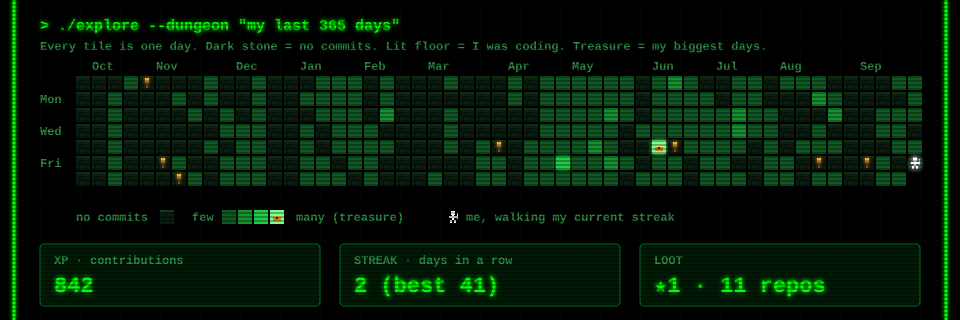

  
  
  
<!-- QUESTS:START -->

<!-- QUESTS:END -->
  

**Computer Engineering Student | Game Engine Developer & Systems Architect**

I'm a software engineer, specializing in **C# and .NET Desktop Development**. I spend my time engineering complex, data-driven systems from scratch ranging from enterprise-level MVVM architectures to custom Object-Oriented game engines.

### 🛠️ Core Tech Stack
* **Languages:** C#, Python(Fundametals)
* **Frameworks/UI:** .NET 10, WPF, MonoGame
* **Concepts:** System Architecture, Strict OOP, State Machines, Decoupled Rendering, Algorithmic Logic

- 🌱 I’m currently learning **Advanced C#** and **Game Design Patterns**.
- 👯 I’m looking to collaborate on **Open Source C# Projects** or **Beginner Game Jams**.
- 💬 Ask me about **C# Logic, State Machines, and Console UI Systems**.
- 📫 How to reach me: [LinkedIn](https://www.linkedin.com/in/iseoluwa-olowogoke-g00ds0ul)
- ⚡ Fun fact: I am building complex financial software just to master the logic systems!

### 📫 Let's Connect
I am highly adaptable, driven by underlying computer science algorithms, and currently seeking environments where I can ship real C# architecture.

  
  
  

<h3 align="left">Languages and Tools:</h3>

  
  
  
  

  

